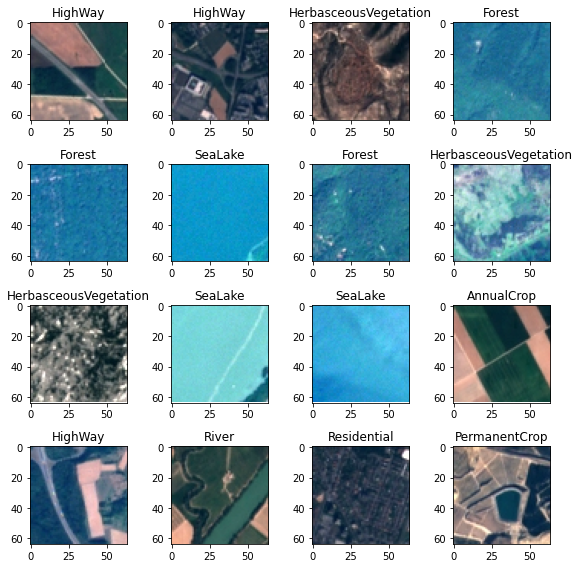
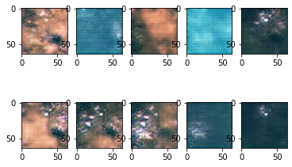

Ce repo contient un notebook qui:
- Crée un GAN
- Entraine le réseau sur le dataset EUROSAT (27000 images satellitaires, 10 classes)
- Utilise le GAN pour générer des images satellitaires

Sur 100 epochs, les résultats sont assez satisfaisants. Avec plus d'entrainement (200/300 epochs), les résultats devraient encore être améliorés.

<h2>Images issues du dataset original EUROSAT</h2>

<h2>Images générées par le GAN après 100 epochs</h2>

